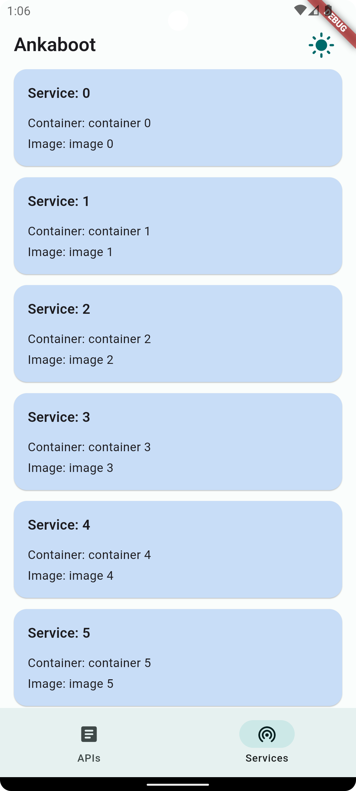

# ankabootmobile

A client project for Ankaboot system. Provides manual control over 
the AMS (API Management System) APIs and monitoring running SMS (Service Management System).

## Architecture
FDD (Feature-Driven-Design) + MVP (Model-View-Presenter) for the presentation layer.

## Pages

### APIs management.
- Provides a list of available API endpoints and ability to filter them by the status.
- Possible to change the status of an endpoint manually
- Possible to create a new API endpoint

### Service Monitoring
- Provides a list of available running services of the Service Management System

